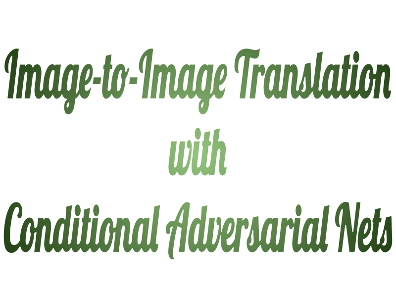

<p align="center">
    
</p>
 
<p align="center">
 
 
 
</p>

 ***

This is an unofficial PyTorch implementation of the paper [Image-to-Image Translation with Conditional Adversarial Nets](https://phillipi.github.io/pix2pix/).

If you find this code useful, please star the repository.

## Getting Started

### Installation
- Clone this repository
```
git clone "https://github.com/FarnoushRJ/MLProject_Pix2Pix.git"
```
- Install the requirements

  **Other Requirements**
   * Pillow 7.0.0
   * numpy 1.18.4
   * matplotlib 3.2.1
   * barbar 0.2.1
   * torch 1.5.0
   * torchvision 0.6.0


### Data
  * Facades and Maps datasets can be downloaded from [this link](http://efrosgans.eecs.berkeley.edu/pix2pix/datasets/).
  
**Data Directory Structure**
```
|__ DATASET_ROOT
    |__ train       
    |__ test
    |__ val     
```

### How to train

```python
cd train/
python train.py --args
```

## Training Loss Curves
The models is trained for 200 epochs on both Facades and Maps datasets. 

<center>
<div>
  <table>
    <tr>
      <td></td>
      <td></td>
      <td></td>
    </tr>
    <tr>
      <td align="center"><em>Facades Training Loss</em></td>
      <td align="center"><em>Maps(AtoB) Training Loss</em></td>
      <td align="center"><em>Maps(BtoA) Training Loss</em></td>
    </tr>
  </table>
</div>
</center>

## Qualitative Results
### Facades Dataset

  <p align="center">
    
    </br>
    
    </br>
    
    </br>
    <em>Input, Fake Target, Real Target</em>
  </p>

### Maps Dataset

<p align="center">
    
    </br>
    
    </br>
    
    </br>
    <em>Input, Fake Target, Real Target (AtoB)</em>
</p>
</br>
<p align="center">
    </td></tr>
    </br>
    </td></tr>
    </br>
    </td></tr>
    </br>
    <em>Input, Fake Target, Real Target (BtoA)</em>
</p>

## TODO List
* Models
  - [ ] Modified Model for deblurring, denoising and Inpainting 

## References
- [pytorch-CycleGAN-and-pix2pix](https://github.com/junyanz/pytorch-CycleGAN-and-pix2pix)
- [pytorch-pix2pix](https://github.com/znxlwm/pytorch-pix2pix)

## License
[](https://opensource.org/licenses/MIT)
