# Image-to-Image Translation with Conditional Adversarial Nets

This is an unofficial PyTorch implementation of the paper [Image-to-Image Translation with Conditional Adversarial Nets](https://phillipi.github.io/pix2pix/).

## Getting Started

### How to train

```python
cd train/
python train.py --args
```

### Full set of arguments

```
usage: train.py [-h] [--netD_name NETD_NAME] [--netD_layers NETD_LAYERS]
                [--netD_in NETD_IN] [--netD_out NETD_OUT]
                [--netD_lambda NETD_LAMBDA] [--netG_in NETG_IN]
                [--netG_out NETG_OUT] [--l1_lambda L1_LAMBDA] [--lr LR]
                [--beta1 BETA1] [--beta2 BETA2] [--batch_size BATCH_SIZE]
                [--epochs EPOCHS] [--dataset_name DATASET_NAME]
                [--direction DIRECTION] --root ROOT
                [--train_folder TRAIN_FOLDER] [--test_folder TEST_FOLDER]
                [--no_crop NO_CROP] [--no_flip NO_FLIP]
                [--crop_size CROP_SIZE] [--scale SCALE]

optional arguments:
  -h, --help            show this help message and exit
  --netD_name NETD_NAME
                        PixelGAN | PatchGAN
  --netD_layers NETD_LAYERS
                        1 | 3 | 5
  --netD_in NETD_IN     number of input channels
  --netD_out NETD_OUT   number of output channels
  --netD_lambda NETD_LAMBDA
                        lambda for discriminator total loss
  --netG_in NETG_IN     number of input channels
  --netG_out NETG_OUT   number of output channels
  --l1_lambda L1_LAMBDA
                        lambda for L1 loss
  --lr LR               learning rate
  --beta1 BETA1         beta1
  --beta2 BETA2         beta2
  --batch_size BATCH_SIZE
                        input batch size
  --epochs EPOCHS       number of epochs
  --dataset_name DATASET_NAME
                        facades | maps
  --direction DIRECTION
                        AtoB | BtoA
  --root ROOT           path to the dataset
  --train_folder TRAIN_FOLDER
                        train | test | val
  --test_folder TEST_FOLDER
                        train | test | val
  --no_crop NO_CROP     True | False
  --no_flip NO_FLIP     True | False
  --crop_size CROP_SIZE
                        crop size
  --scale SCALE         scale
```
## Qualitative Results
### Facades Dataset

<center>
  <table>
    <tr><td>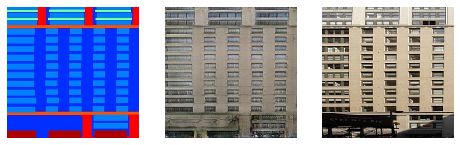</td></tr>
    <tr><td>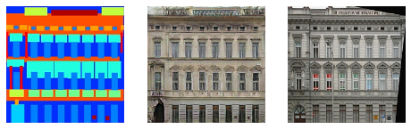</td></tr>
    <tr><td>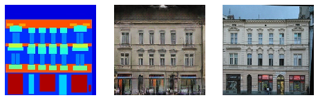</td></tr>
    <tr><td align="center"><em>Input, Fake Target, Real Target</em></td></tr>
  </table>
</center>

### Maps Dataset

<center>
<div>
  <table>
    <tr><td>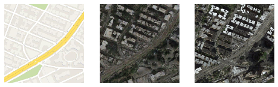</td></tr>
    <tr><td>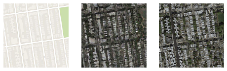</td></tr>
    <tr><td>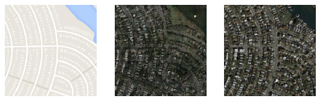</td></tr>
    <tr><td align="center"><em>Input, Fake Target, Real Target (AtoB)</em></td></tr>
  </table>
  <table>
    <tr><td>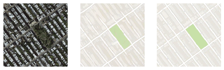</td></tr>
    <tr><td>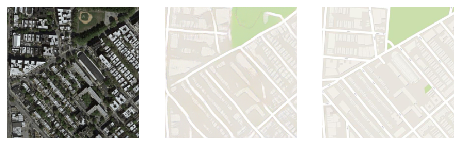</td></tr>
    <tr><td>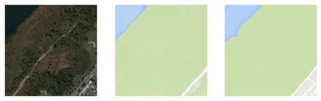</td></tr>
    <tr><td align="center"><em>Input, Fake Target, Real Target (BtoA)</em></td></tr>
  </table>
</div>
</center>

## Training Loss Curves
The models is trained for 200 epochs on both Facades and Maps datasets. 

<center>
<div>
  <table>
    <tr>
      <td>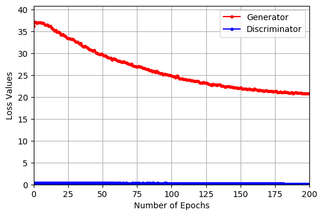</td>
      <td>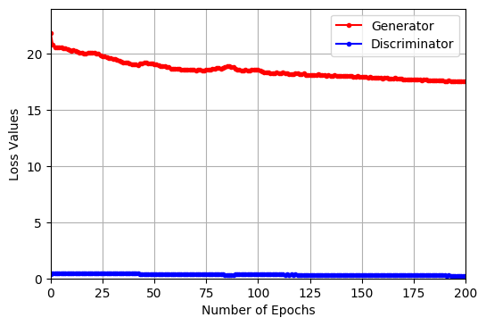</td>
      <td></td>
    </tr>
    <tr>
      <td align="center"><em>Facades Training Loss</em></td>
      <td align="center"><em>Maps(AtoB) Training Loss</em></td>
      <td align="center"><em>Maps(BtoA) Training Loss</em></td>
    </tr>
  </table>
</div>
</center>

## TODO List
* Models
  - [ ] Modified Model for deblurring, denoising and Inpainting 

## Acknowledgement
- [pytorch-CycleGAN-and-pix2pix](https://github.com/junyanz/pytorch-CycleGAN-and-pix2pix)
- [pytorch-pix2pix](https://github.com/znxlwm/pytorch-pix2pix)

## License
[](https://opensource.org/licenses/MIT)
